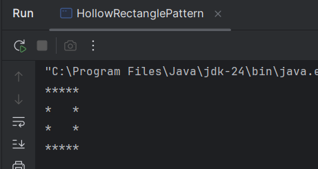

# Java-Pattern-Programs
Basic java programs to practice loops

# Hollow Rectangle Pattern Program in Java
This is a simple Java program that prints a hollow rectangle star pattern. The program uses loops to create the border of the rectangle with stars ('*'), leaving spaces inside to make it hollow.
# Code Explanation:
1. Variables:
   - int n = 4 - Represents the number of rows in the rectangle.
   - int m = 5 - Represents the number of columns in the rectangle.

2. Outer loop (for i):
   - Loops through each row of the rectangle. The loop runs from i = 1 to n (number of rows).

3. Inner loop (for j) with Conditionals:
   - Loops through each column of the current row. the loops runs from j = 1 to m (number of columns).
   - Uses an 'if-else' condition to decide what to print:
      - It checks if the current position is on the border (either the first or last row, or first or last column). If true, it prints a star('*).
      - Else, it prints a space (' ') to create the hollow effect inside rhe rectangle.

4. Printing:
   - The stars are printed for the border ( first and last rows, first and last columns), and spaces are printed inside the rectangle to create the hollow shape.
# Output:

   
